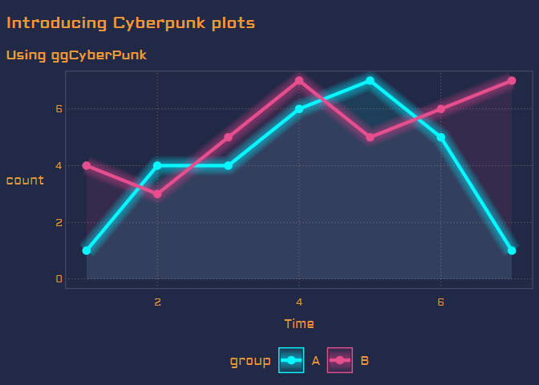

ggCyberPunk
================
Joshua de la Bruere
4/2/2020


[](https://www.tidyverse.org/lifecycle/#experimental)

<!-- -->

## Installation

This isn’t on CRAN, so you’ll have to use devtools.

`devtools::install_github("delabj/ggCyberPunk")`

## Dependancies

This package uses extrafont to install the cyberpunk font. If you don’t
want to use this, you can always specify a font that your system has
installed and the R recongnizes.

This package also uses ggplot2, this is required for the plot to
actually function.

Additionally, dplyr is used to make some of the internal code a bit more
readable.

## Why?

The other day, I saw a post on
[reddit](https://www.reddit.com/r/rstats/comments/fsncqz/cyberpunk_plots_in_r/)
asking if there was a way to create a “CyberPunk plot” in R. This was
based on plots produced in python using matplotlib as shown on [this
repo](https://github.com/dhaitz/mplcyberpunk). Since it’s the end times,
and I have nothing better to do at home than poke around with a theme,
this seemed like a perfect fit.

If you want more cyberpunk themed plot options, palettes, and themes,
check out [vapoRwave](https://github.com/moldach/vapoRwave), from which
I totally stole the base theme for this package. A few modifications,
but it’s very much the new\_retro theme.

## What’s in the box?

### geom\_glowing\_area()

A glowing area plot for a cyberpunk/disco/neon vibe.

#### Useage

geom\_glowing\_area(alpha = 1, size = 1, glow\_alpha = 0.03)

#### Arguments

`alpha`: the alpha level of the base line `size`: size of the base line
`glow_alpha`: set the alpha level of the glow layers

#### Example

``` r
library(tidyverse)
library(ggCyberPunk)

df = data.frame(A=c(1,4,4,6,7,5,1),
               B=c(4,3,5,7,5,6,7),
               Time=c(1,2,3,4,5,6,7)) %>%
pivot_longer(cols = c(A,B),names_to = "group", values_to = "count")


df %>%
   ggplot(aes(x=Time, y = count, color = group, fill= group))+
     geom_glowing_area()+
     theme_cyberpunk()+
     scale_fill_cyberpunk("zune")+
     scale_color_cyberpunk("zune")+
  ggtitle("geom_glowing_area()", subtitle = "From ggCyberPunk")
```

<!-- -->

### geom\_glowing\_line()

A glowing line plot for a cyberpunk/disco/neon vibe.

#### Useage

geom\_glowing\_line(alpha = 1, size = 1, glow\_alpha = 0.03)

#### Arguments

`alpha`: the alpha level of the base line `size`: size of the base line
`glow_alpha`: set the alpha level of the glow layers

#### Example

``` r
library(tidyverse)
library(ggCyberPunk)

df = data.frame(A=c(1,4,4,6,7,5,1),
               B=c(4,3,5,7,5,6,7),
               Time=c(1,2,3,4,5,6,7)) %>%
pivot_longer(cols = c(A,B),names_to = "group", values_to = "count")


df %>%
   ggplot(aes(x=Time, y = count, color = group, fill= group))+
     geom_glowing_line()+
     theme_cyberpunk()+
     scale_color_cyberpunk()+
  ggtitle("geom_glowing_line()", subtitle = "From ggCyberPunk")
```

<!-- -->

### geom\_linesaber()

A glowing line plot for a laser sword look.

#### Useage

geom\_linesaber(alpha = 1, size = 1, glow\_alpha = 0.03)

#### Arguments

`alpha`: the alpha level of the base line `size`: size of the base line
`glow_alpha`: set the alpha level of the glow layers

#### Example

``` r
library(tidyverse)
library(ggCyberPunk)

df = data.frame(A=c(1,4,4,6,7,5,1),
               B=c(4,3,5,7,5,6,7),
               Time=c(1,2,3,4,5,6,7)) %>%
pivot_longer(cols = c(A,B),names_to = "group", values_to = "count")


df %>%
   ggplot(aes(x=Time, y = count, color = group, fill= group))+
     geom_linesaber()+
     theme_cyberpunk()+
     scale_color_linesaber(reverse = T)+
  ggtitle("geom_linesaber()", subtitle = "From ggCyberPunk")
```

<!-- -->

## Also included are palettes

### main

<!-- -->

### Cotton Candy

<!-- -->

### zune

<!-- -->

### laser sword

<!-- -->

## scale\_fill\_cyberpunk/scale\_color\_cyberpunk

### usage

`scale_fill_cyber_punk(palette = "main", discrete = T, reverse = F )`
`scale_color_cyber_punk(palette = "main", discrete = T, reverse = F )`

## scale\_fill\_linesaber/scale\_color\_linesaber

### usage

`scale_fill_linesaber(palette = "main", discrete = T, reverse = F )`
`scale_color_linesaber(palette = "main", discrete = T, reverse = F )`
